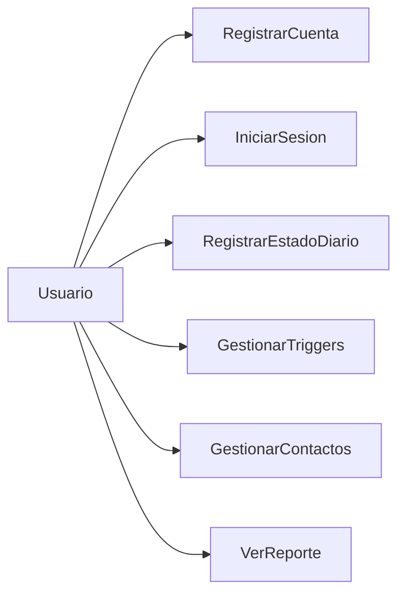

# Casos de uso general

```mermaid
flowchart LR
  Usuario[Usuario] --> RegistrarCuenta[RegistrarCuenta]
  Usuario --> IniciarSesion[IniciarSesion]
  Usuario --> RegistrarEstadoDiario[RegistrarEstadoDiario]
  Usuario --> GestionarTriggers[GestionarTriggers]
  Usuario --> GestionarContactos[GestionarContactos]
  Usuario --> VerReporte[VerReporte]
```
