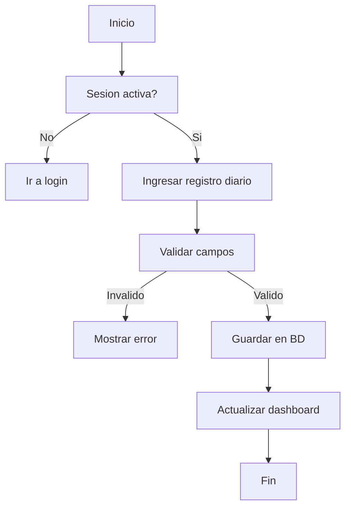

# Diagrama de actividades

```mermaid
flowchart TD
  startNode[Inicio] --> authCheck[Sesion activa?]
  authCheck -->|No| loginNode[Ir a login]
  authCheck -->|Si| inputNode[Ingresar registro diario]
  inputNode --> validateNode[Validar campos]
  validateNode -->|Invalido| errorNode[Mostrar error]
  validateNode -->|Valido| saveNode[Guardar en BD]
  saveNode --> dashboardNode[Actualizar dashboard]
  dashboardNode --> endNode[Fin]
```
