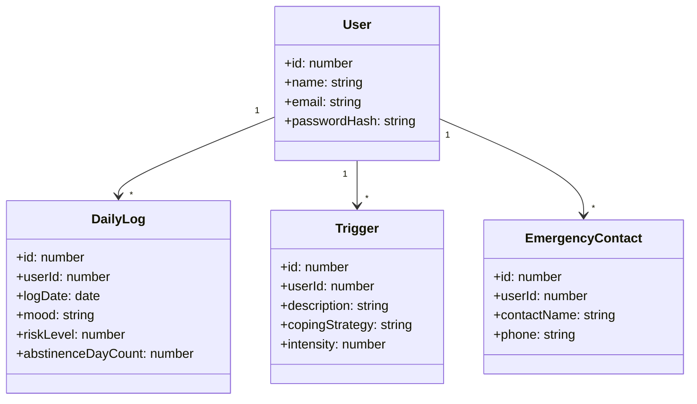

# Diagrama de clases

```mermaid
classDiagram
  class User {
    +id: number
    +name: string
    +email: string
    +passwordHash: string
  }
  class DailyLog {
    +id: number
    +userId: number
    +logDate: date
    +mood: string
    +riskLevel: number
    +abstinenceDayCount: number
  }
  class Trigger {
    +id: number
    +userId: number
    +description: string
    +copingStrategy: string
    +intensity: number
  }
  class EmergencyContact {
    +id: number
    +userId: number
    +contactName: string
    +phone: string
  }
  User "1" --> "*" DailyLog
  User "1" --> "*" Trigger
  User "1" --> "*" EmergencyContact
```
