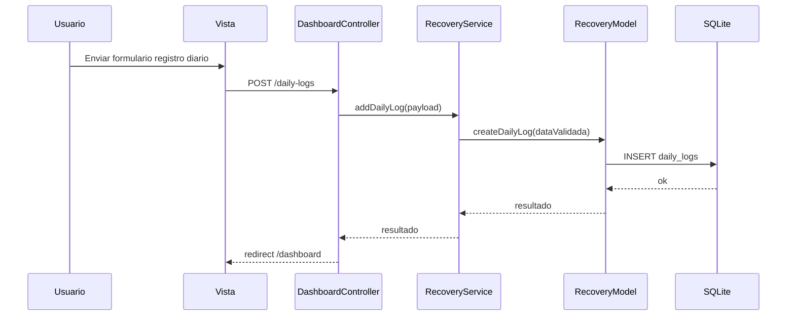

# Diagrama de secuencia

```mermaid
sequenceDiagram
  participant user as Usuario
  participant view as Vista
  participant controller as DashboardController
  participant service as RecoveryService
  participant model as RecoveryModel
  participant db as SQLite

  user->>view: Enviar formulario registro diario
  view->>controller: POST /daily-logs
  controller->>service: addDailyLog(payload)
  service->>model: createDailyLog(dataValidada)
  model->>db: INSERT daily_logs
  db-->>model: ok
  model-->>service: resultado
  service-->>controller: resultado
  controller-->>view: redirect /dashboard
```
